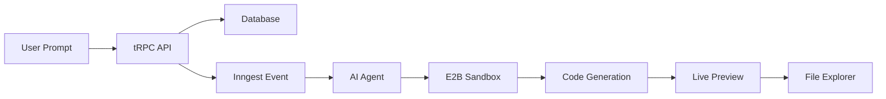

# 🚀 Vibe

<div align="center">

**AI-powered development platform that lets you create web applications by chatting with AI agents in real-time sandboxes.**

[](https://nextjs.org/)
[](https://reactjs.org/)
[](https://www.typescriptlang.org/)
[](https://tailwindcss.com/)

</div>

## ✨ Features

<table>
<tr>
<td width="50%">

- 🤖 **AI Code Generation** - GPT-4 powered agents
- 💻 **Real-time Development** - E2B sandboxes
- 🔄 **Live Preview** - Split-pane interface
- 📁 **File Explorer** - Syntax highlighting
- 💬 **Conversational** - Message history

</td>
<td width="50%">

- 🎯 **Usage Tracking** - Smart rate limiting
- 💳 **Subscriptions** - Pro features
- 🔐 **Authentication** - Clerk integration
- 📱 **Responsive** - Mobile friendly
- ⚙️ **Background Jobs** - Inngest processing

</td>
</tr>
</table>

## 🛠️ Tech Stack

<div align="center">

**Frontend**
[](https://nextjs.org/)
[](https://reactjs.org/)
[](https://www.typescriptlang.org/)
[](https://tailwindcss.com/)

**Backend**
[](https://trpc.io/)
[](https://prisma.io/)
[](https://postgresql.org/)

**AI & Services**
[](https://openai.com/)
[](https://e2b.dev/)
[](https://clerk.com/)
[](https://inngest.com/)

</div>

## 🚀 Quick Start

```bash
# 1. Clone repository
git clone <your-repo-url>
cd nextjs-vibe-main

# 2. Install dependencies
npm install

# 3. Setup environment
cp .env.example .env.local
# Fill in your API keys

# 4. Setup database
npx prisma migrate dev

# 5. Start development
npm run dev
```

## 🔧 Environment Variables

```bash
# Database
DATABASE_URL="postgresql://..."

# Authentication (Clerk)
NEXT_PUBLIC_CLERK_PUBLISHABLE_KEY="pk_..."
CLERK_SECRET_KEY="sk_..."

# AI (OpenAI)
OPENAI_API_KEY="sk-..."

# Sandbox (E2B)
E2B_API_KEY="e2b_..."

# Background Jobs (Inngest) - Production only
INNGEST_EVENT_KEY="your-inngest-event-key"
INNGEST_SIGNING_KEY="your-inngest-signing-key"
```

## 📁 Project Structure

```
src/
├── app/                 # Next.js app router
├── components/          # Reusable UI components
├── modules/             # Feature modules
│   ├── home/           # Landing page
│   ├── projects/       # Project management
│   └── messages/       # Chat system
├── inngest/            # Background jobs
├── lib/                # Utilities
└── trpc/               # API layer
```

## 🎯 How It Works



## 📋 Available Scripts

| Command | Description |
|---------|-------------|
| `npm run dev` | Start development server |
| `npm run build` | Build for production |
| `npm run start` | Start production server |
| `npm run lint` | Run ESLint |
| `npx prisma studio` | Open database studio |
| `npx prisma migrate dev` | Run database migrations |

## 🌟 Features in Detail

### 🤖 AI-Powered Development
- **GPT-4 Integration** - Advanced AI code generation
- **Real-time Processing** - Instant feedback and updates
- **Context Awareness** - Remembers conversation history

### 💻 Sandbox Environment
- **E2B Integration** - Isolated development environments
- **Live Preview** - Real-time application preview
- **File Management** - Complete file system access

### 🎨 Modern UI/UX
- **Shadcn/ui** - Beautiful, accessible components
- **Dark Mode** - Full theme support
- **Responsive** - Mobile-first design
- **Animations** - Smooth interactions

## 📄 License

This project is licensed under the MIT License - see the [LICENSE](LICENSE) file for details.

## 🤝 Contributing

1. Fork the repository
2. Create your feature branch (`git checkout -b feature/AmazingFeature`)
3. Commit your changes (`git commit -m 'Add some AmazingFeature'`)
4. Push to the branch (`git push origin feature/AmazingFeature`)
5. Open a Pull Request

---

<div align="center">

**Built with ❤️ by [Hanzla Masood](https://github.com/codewithhazzi)**

[](https://github.com/codewithhazzi/Vibe)
[](https://github.com/codewithhazzi/Vibe)

</div>